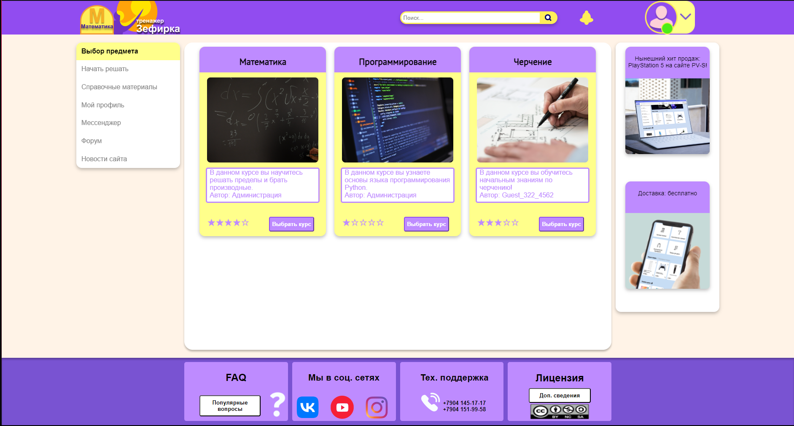
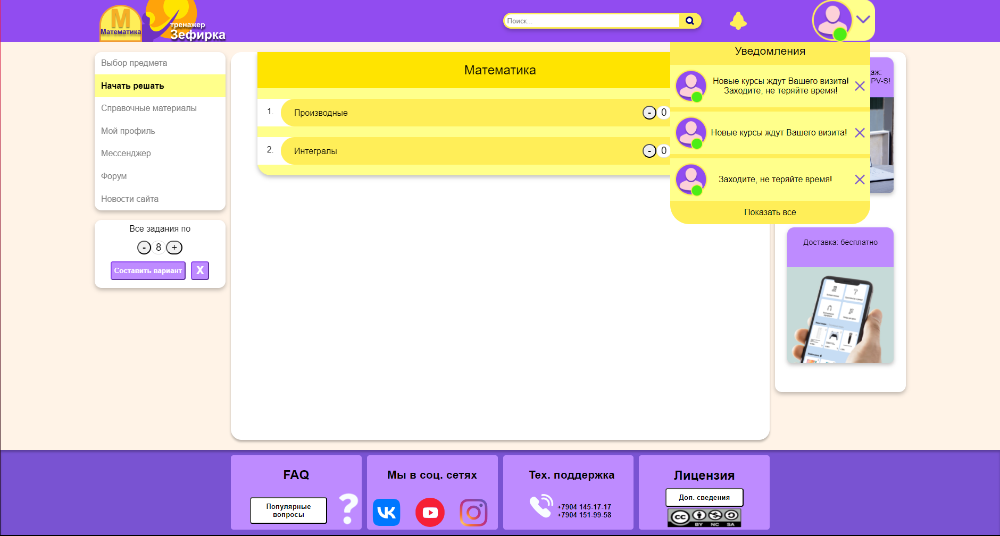

<h1 align="center">Website prototype</h1>

The theme of the prototype site is free and is chosen by the student independently.
The prototype of the site should assume a target audience (a group of people who are expected to use the created resource).
The project should contain information about similar existing sites and identify its own differences from analogues
The planned content of the site should correspond to the stated theme and objectives.
The project should include:
    warframe of the main page for large and telephone screens
    layout (mockup) of the main page for PC and phone screens
    warframe and layout of the additional page, if the differences in the grid compared to the main page are large enough
    page layout

## [DEMONSTRATION OF WEBSITE PROTOTYPE](https://gitlab.com/chfirchcoluna/electronic-portfolio/-/blob/main/1st_year_2nd_semester/graphic_design/website_prototype/prezentatsiya-domnenko-suslikov.pdf)

